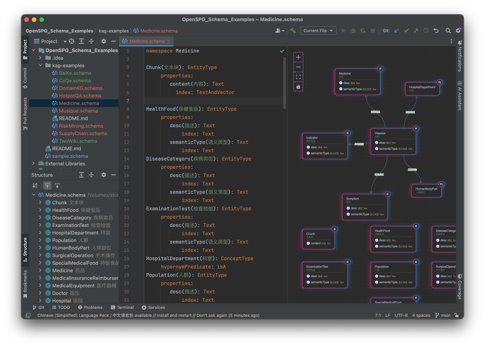

# OpenSPG Schema Mark Language Highlighter Idea Plugin

An IDEA plugin for OpenSPG schema mark language syntax highlighting

- [JETBRAINS Marketplace](https://plugins.jetbrains.com/plugin/26288-openspg-schema-mark-language-highlighter/)

## Preview

    </img>

## Features:

- Code style settings
- Color setting page
- Commenter
- Completion
- Formatter
- Line marker
- Reference
- Syntax highlighter
- Structure view
- Preview

## TODO

- Annotator
- Quick fix
- Spell checking
- Find usages
- [Live template](https://plugins.jetbrains.com/docs/intellij/live-templates.html)
